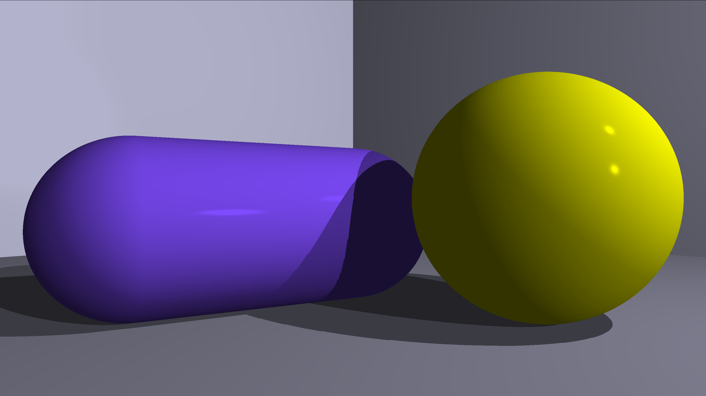

# Raymarhing in Go and Raylib

Again, experimenting with some 3D, using [this book](https://gabrielgambetta.com/computer-graphics-from-scratch/index.html), but I modified it to use ray marching algorithm instead of raytracing. This allowed me to easily add planes, and I'm sure I'll add some more complicated objects soon.

